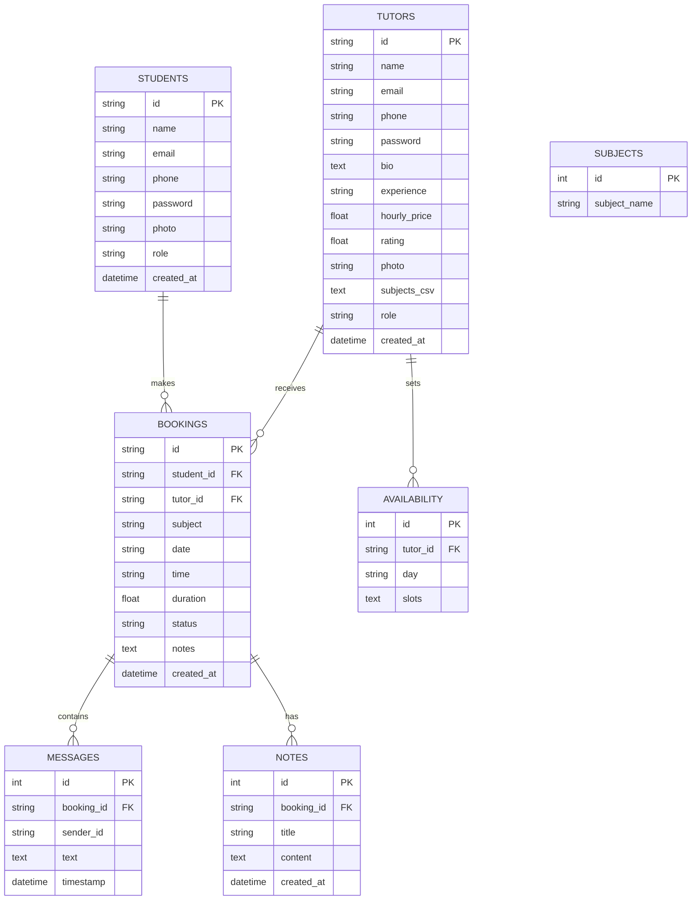

# 🎓 TutorFlow: Online Tutoring Management System

This document provides a comprehensive overview of the features, system architecture, and database design of the **TutorFlow** platform.

---

## 🚀 Key Features

### 1. 🔐 User Authentication & Roles
*   **Multi-Role Access**: Three distinct account types: **Students**, **Tutors**, and **Administrators**.
*   **Secure Registration**: Role-specific registration (Student vs. Tutor).
*   **Persistent Login**: State-managed sessions using professional authentication logic.

### 2. 👩‍🎓 Student Features
*   **Personal Dashboard**: Real-time stats on upcoming sessions, completed hours, and active tutors.
*   **Advanced Tutor Search**: Filter tutors by subject, price range, and rating.
*   **Smart Booking**: Request sessions with specific tutors for specific dates and times.
*   **Session Tracking**: View booking history and track current session status (Pending, Confirmed, Completed).
*   **Profile Management**: Upload profile pictures and update contact information.

### 3. 👨‍🏫 Tutor Features
*   **Tutor Command Center**: Specialized dashboard showing earnings, weekly activity charts, and pending requests.
*   **Availability Management**: Set specific time slots for each day of the week (e.g., 9 AM - 6 PM).
*   **Request Management**: Accept or reject incoming student requests.
*   **Expert Profile**: Showcase bio, experience, hourly rates, and specialized subjects.

### 4. 🏢 Interactive Session Room ("The Classroom")
*   **Private Chat**: Secure, real-time messaging between tutor and student for each confirmed booking.
*   **Shared Notes/Links**: Share PDFs, homework links, or session notes that persist for the duration of the course.
*   **Meeting Integration**: "Start Video Call" integration with quick-copy meeting links for Zoom or Google Meet.

### 5. 🛠️ Admin Features
*   **Centralized Oversight**: Manage all users (Students & Tutors) from a single view.
*   **Subject Management**: Dynamically add or remove subjects available on the platform.
*   **Platform Statistics**: High-level tracking of total subjects, users, and platform health.

---

## 📊 Database Architecture (ERD)

The following diagram illustrates the relationships between the core entities in the TutorFlow MySQL database.

---

## 🛠️ Technology Stack
*   **Frontend**: HTML5, CSS3, Tailwind CSS (Design Engine), Vanilla JavaScript.
*   **Backend**: Python Flask (RESTful API).
*   **Database**: MySQL (Relational persistence).
*   **ORM**: SQLAlchemy (Database management).
*   **Icons & Fonts**: Google Material Symbols & Lexend Typography.

---

## 📂 Project Structure
*   `/backend`: Flask app, routes, and models.
*   `/js`: Frontend logic (auth, dashboard, bookings, session interaction).
*   `/*.html`: Page structure and UI.
*   `data.js`: The central API bridge/bridge between frontend and backend.
